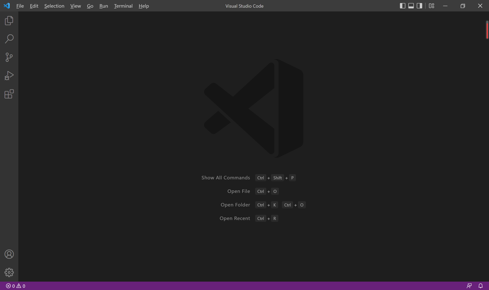
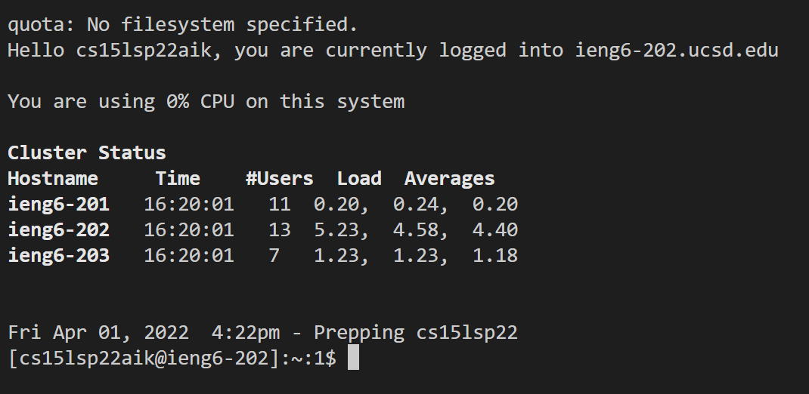
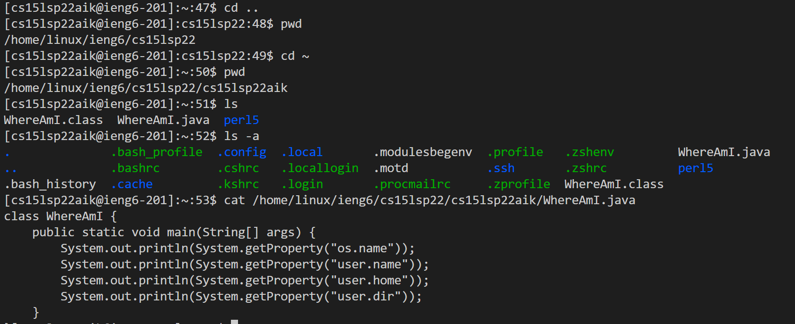
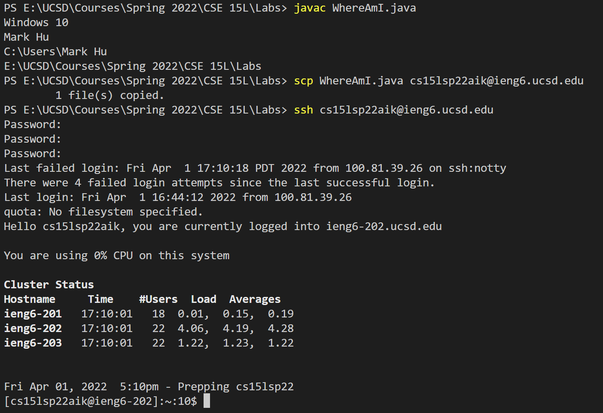
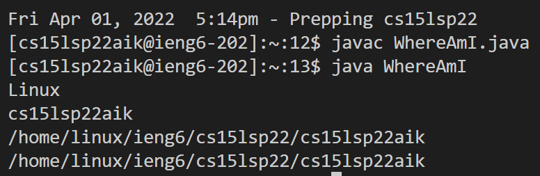
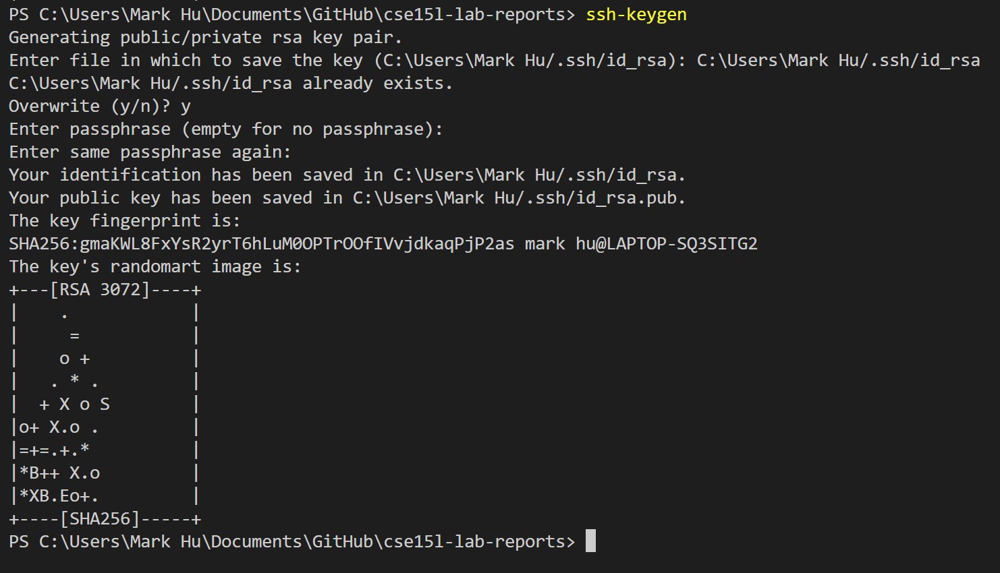
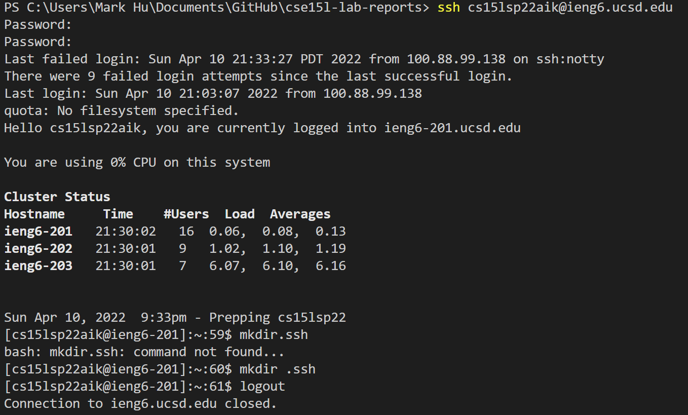
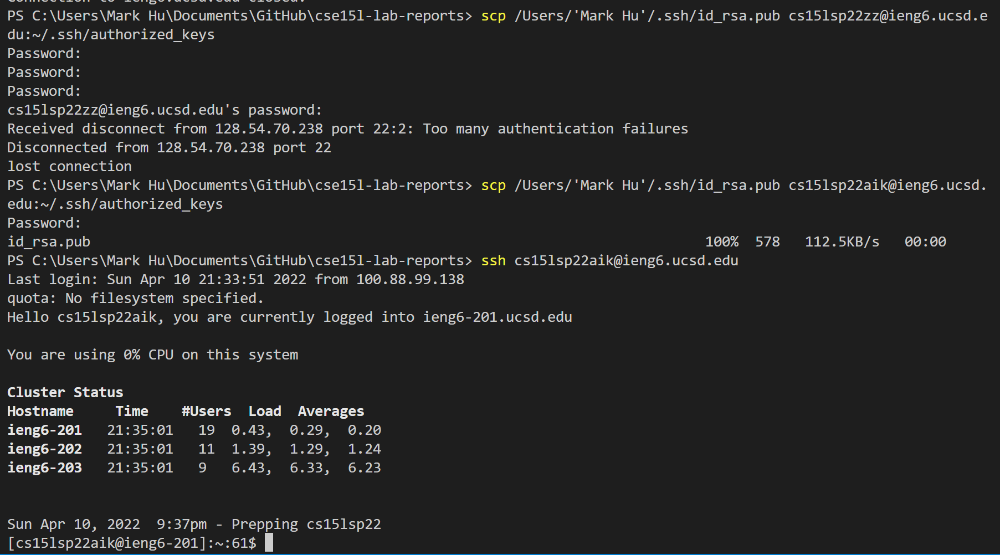
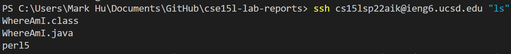
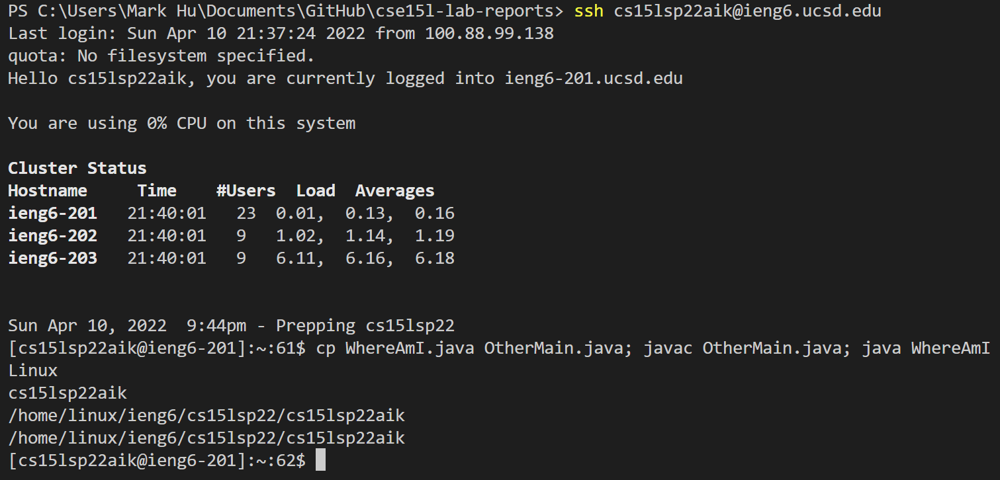

# A tutorial on how to log into a course-specific account on ieng6

## **Step 1: Installing VS Code** 
Go to VS Code website to down load VS Code. [Link is here.](https://code.visualstudio.com/)  
Open the VS Code after installation and you should be able to see a fresh window similar to the following picture:  

---

## **Step 2: Remote Connection**  
1. Open a new terminal in VSCode. Then enter the following command:  
`$ ssh cs15lsp22zz@ieng6.ucsd.edu`  
with zz replaced by the letters in your course-specific account.
2. Type yes to the message you get (the message should look like  
`The authenticity of host 'ieng6.ucsd.edu (128.54.70.227)' can't be established.`) and press enter.
3. Type your password afterwords and you should get a page similar to the following:  
  

---

## **Step 3: Some useful commands**
You can try some commands that enables you to do a variety of cool operations. Here are some examples:  

---

## **Step 4: Moving Files with `scp`**
1. Create a java file on your computer, for example a WhereAmI.java file(**Not on the remote server!**)).
2. Run the following command in the terminal from the directory where you made the file:  
`scp WhereAmI.java cs15lsp22zz@ieng6.ucsd.edu:~/`
3. Log back into the remote server and you should be able to see your file (here it is WhereAmI.java) using the `ls` command.

---

## **Step 5: Setting an SSH Key**
1. Create a private key and a public key stored in the .ssh directory in your personal computer.

2. Copy the public key to the remote server.

3. You should be able to login to the remote server without typing out the password after the aforementioned steps.
---

## **Step 6: Optimizing Remote Running**
1. You can directly type a command at the end of an `ssh` command to run it right after login instead of loggin in first and then run the command.
  
2. You can use semicolons to run more than one command at a time.

