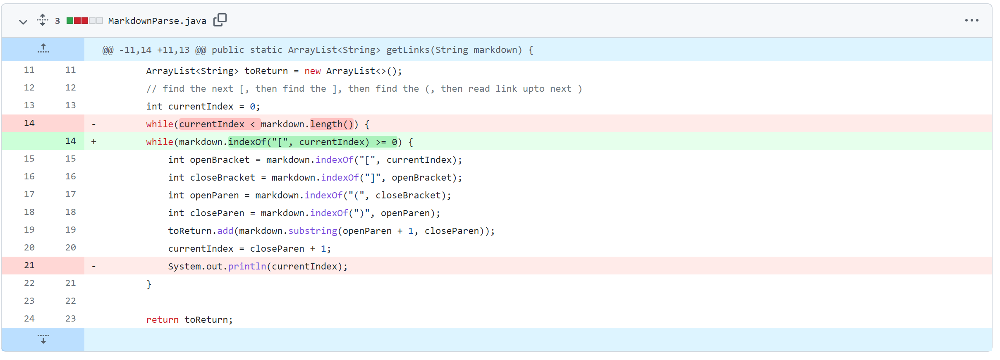
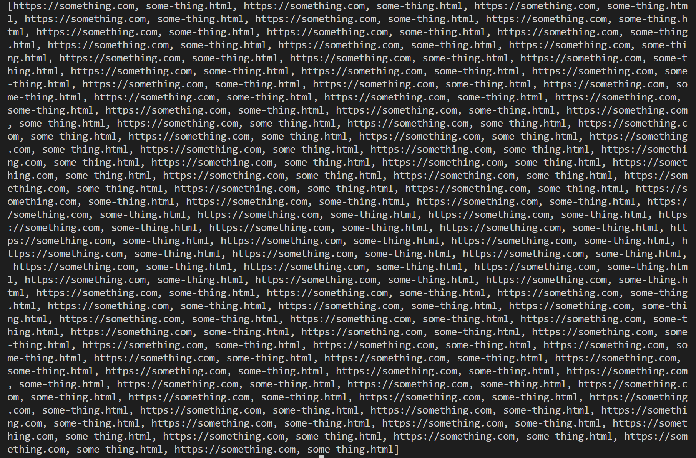
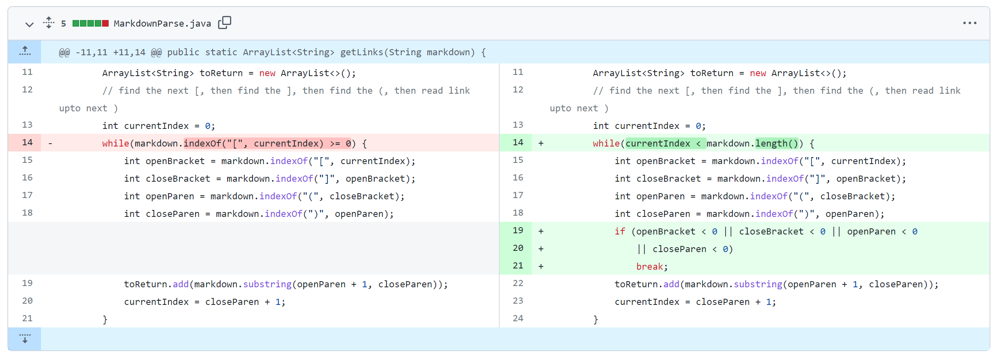
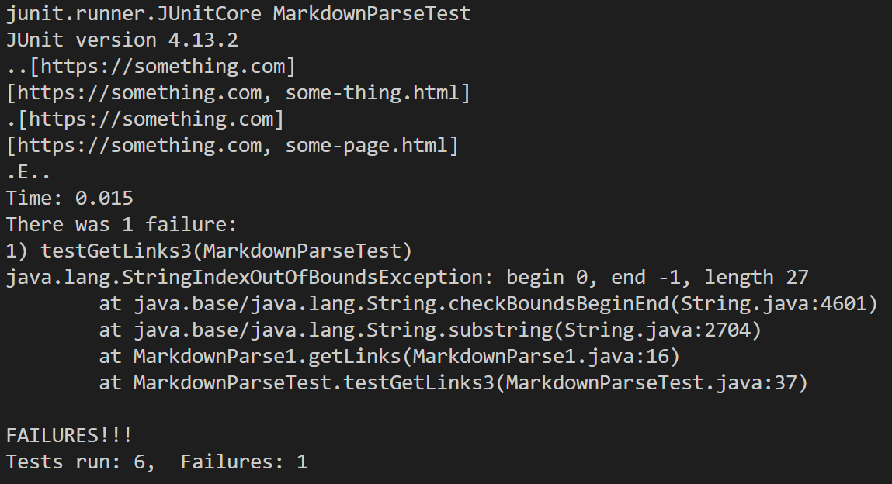
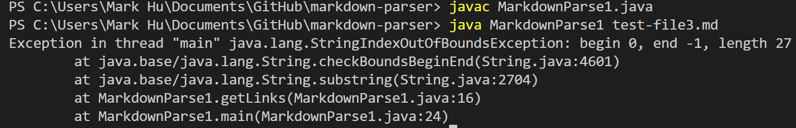
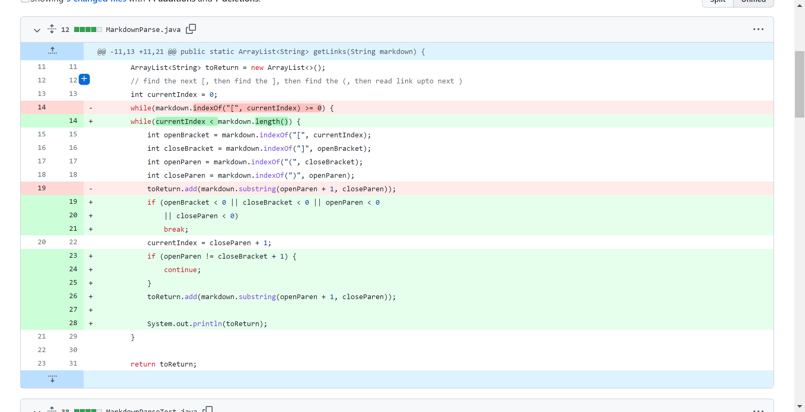
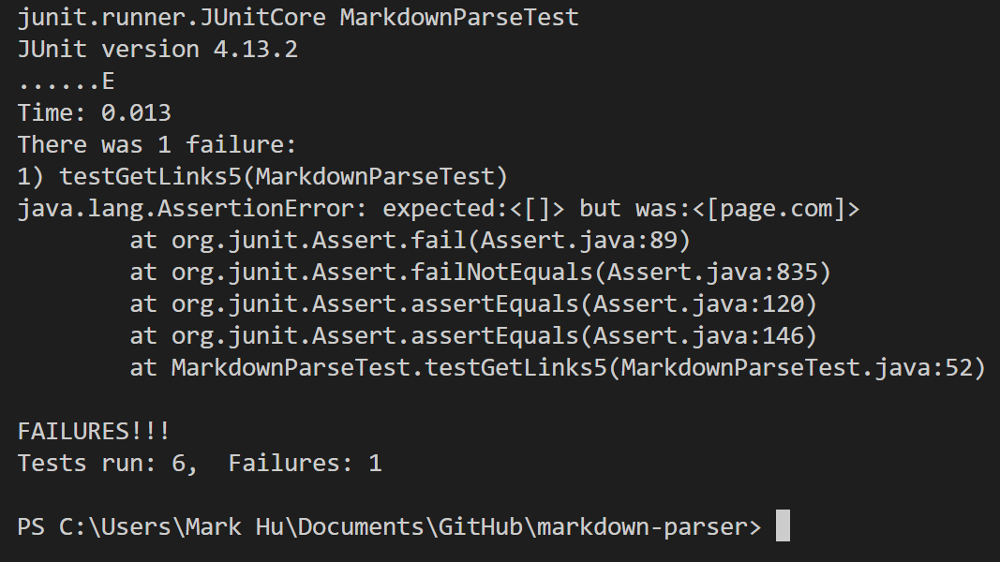
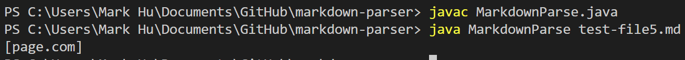

# Testing and Debugging  

## Three code changes:  

### Code Change 1  
1. A picutre of the code change diff:
  
2. [A link to the failure-inducing test file:](https://github.com/MarkH857/markdown-parser/blob/main/test-file.md)  
3. The symptom of the aforementioned failure-inducing input:  
  
4. The bug here is that the get-link method uses the comparison between the
updated current index and the length of the markdown file as the evaluating 
condition for the while loop. Therefore, when a file where there are spaces
or an empty line at the end (the failure-inducing input) is given, the output 
will print out infinitely many lists containing the same content, which is the
symptom.

### Code Change 2  
1. A picture of the code change diff:
  
2. [A link to the failure-inducing test-file:](https://github.com/MarkH857/markdown-parser/blob/main/test-file3.md)  
3. The symptom of the aforementioned failure-inducing input:  
  
When running the code directly, it gives out an string index out of bound
exception.
  
4. The bug here is that the get-link method assumes that there must be an 
open and a close parenthese in the file (because during each loop it looks
for the index of these characters), so when a file where there is only brackets
(the failure-inducing) is given, it will give an string index out of bound
exception, which is the symptom.

### Code Change 3   
1. A picture of the code change diff:
  
2. [A link to the failure-inducing test file:](https://github.com/MarkH857/markdown-parser/blob/main/test-file5.md)  
3. The symptom of the aforementioned failure-inducing input:  
  
When running the code directly, it prints out a list with page.com while it is
supposed to print out an empty list.
  
4. The bug here is that the get-link method always searches for the content 
between the parentheses that is after the brackets, so when a file in which 
the parentheses are far away from the brackets (the failure-inducing input) is
 the input, the output still prints out the content between the brackets, which 
 is the symptom (it is supposed to print out an empty list).