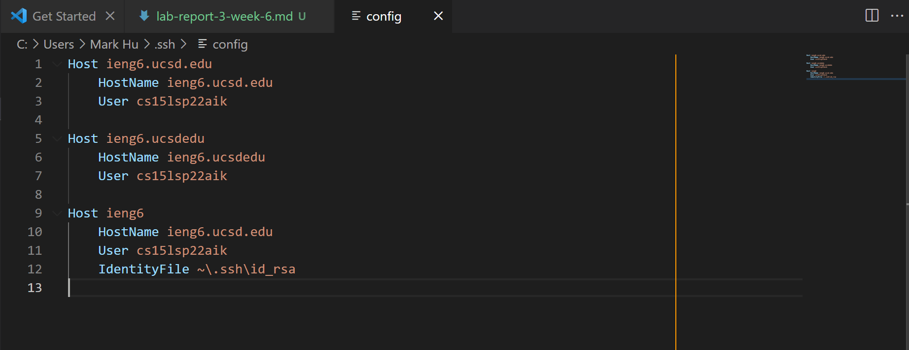
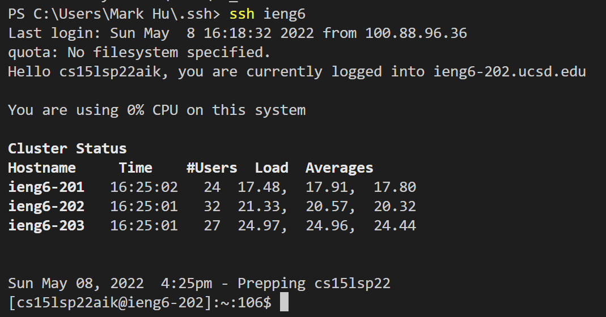
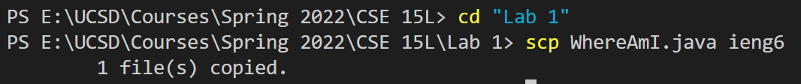
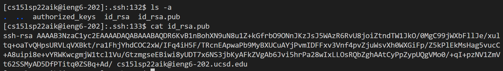
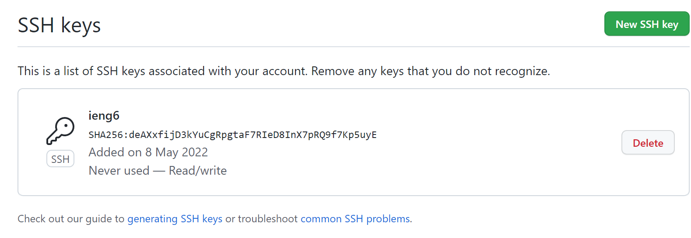
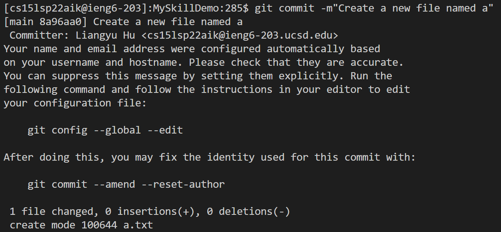
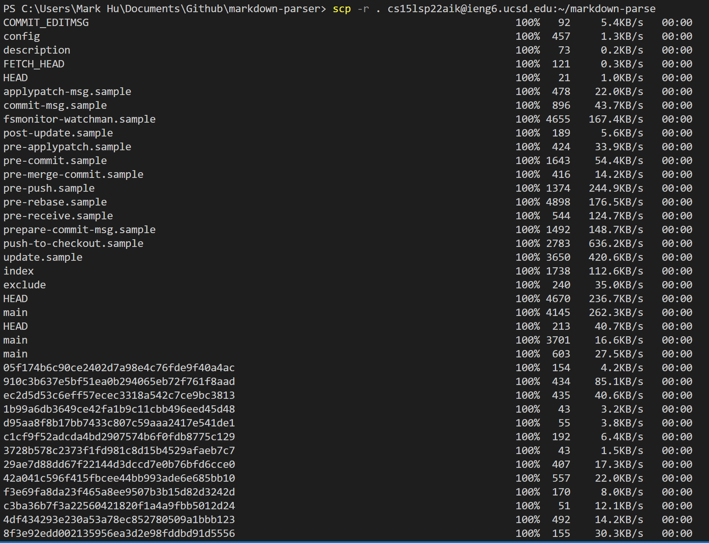
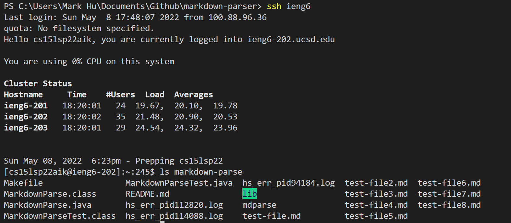
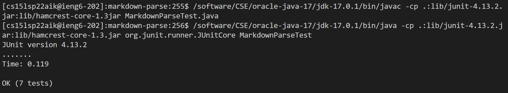

# More Advanced Features using Remote Server  

## Streamlining ssh Configuration  
1. A picture of the .ssh/config `.ssh/config`:  
  
2. A picture of logging into the remote server with just "ieng6":  
  
3. A picture of copying a file to the server with just "ieng6":  
  

## Setup Github Access from ieng6  
1. A picture of the public key and private key stored on the server:
  
2. A picture of the public key stored on Github:
  
3. A picture of committing and pushing a change from server to Github:
  
4. [A link to the commit:](https://github.com/MarkH857/MySkillDemo/commit/8a96aa054b9660fe9239bb3533cbbf00114065d6)

## Copy Whole directories with `scp -r`  
1. A picture showing the copied markdown-parse directory on the remote server:
  
  
2. A picture of compiling and running the tests on the server:
  
3. A picture of copying the directory and running the test in a single command:
  