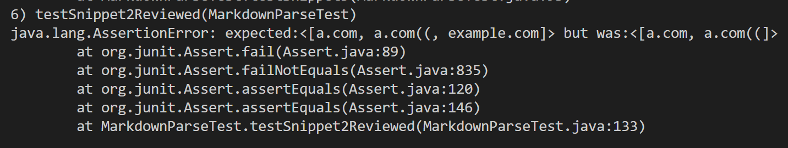

# 4th Lab Report - testing two different implementation of markdown-parse  

**Note: I am using VSCode preview as a reference for valid links.**  

## Links to the repos  
1. [Link to my markdown-parse repository:](https://github.com/MarkH857/markdown-parser)  
2. [Link to the review markdown-parse repository:](https://github.com/colecarter96/markdown-parser)  

## Tests on snippet 1  
1. The expected output should be: ["`google.com", "google.com", "ucsd.edu"].  
2. A picture of the actual test in MarkdownParseTest.java:  
  
3. A picture of the corresponding output for my implementation:  
  
4. A picture of the corresponding output for the implementation reviewed:  
  
5. I believe there is a small code change that will make my program work for
snippet 1 and all other cases with backticks. I can add an if-statement that 
checks whether there is a backtick in front of the closed bracket (i.e. check
whether the character at index of closedBracket - 1 is a backtick). This should
not take more than 10 lines to implement.

## Tests on snippet 2  
1. The expected output should be: ["a.com", "a.com(())", "example.com"]  
2. A picture of the actual test in MarkdownParseTest.java:  
  
3. A picture of the corresponding output for my implementation:  
  
4. A picture of the corresponding output for the implementation reviewed:  
  
5. I think there is definitely a code change that will make my program work for
snippet 2 and other cases that involve nest parentheses, brackets, and escaped 
brackets, but it will probably go beyond 10 lines. I think I need to have three 
different methods for these three cases, since they cannot be resolved by a 
single method. For nest parentheses, I need to develop a method similar to the
findCloseParen in class that searches for the last close parenthese index, but 
for the nest bracket case here, since it creates a nested link inside a pair of
brackets, I need to implement a method that specifically checks for whether 
there is a valid link form inside a pair of brackets, which works differently 
from the findCloseParen method. Therefore, it will end up becoming longer than 
10 lines.

## Tests on snippet 3  
1. The expected out should be: ["https://www.twitter.com", "https://sites.google.com/eng.ucsd.edu/cse-15l-spring-2022/schedule", "https://cse.ucsd.edu/"]  
2. A picture of the actual test in MarkdownParseTest.java:  
  
3. A picture of the corresponding output for my implementation:  
  
4. A picture of the corresponding output for the implementation reviewed:  
  
5. Similar to snippet 2, there is a code change that will make it work, but it 
will likely to go over 10 lines as well. First, I need to have a method that 
checks for the number of closed parentheses after a certain open parenthese to
check if it is a valid link. Then I need to add another method to delete all 
the additional spaces in the output links, since I am printing several correct 
links, the problem is the output includes all of the spaces in between the 
links, which is unnecessary. For newlines in brackets, I think my code is 
already doing a pretty good job, so no additional method is needed for that.