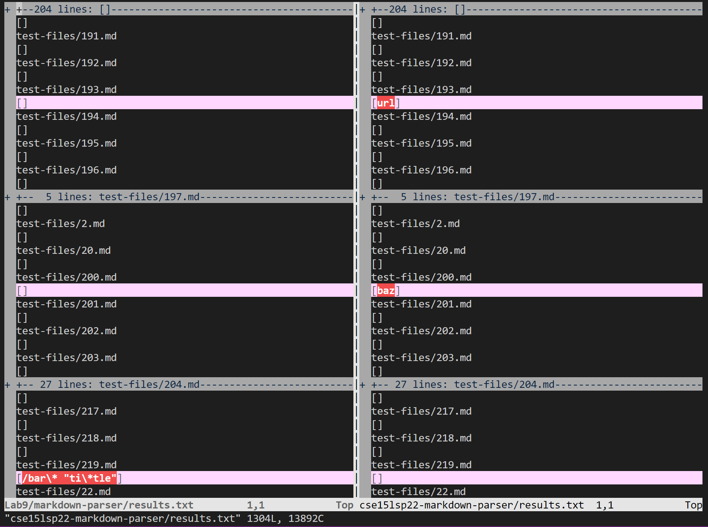
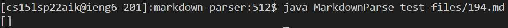
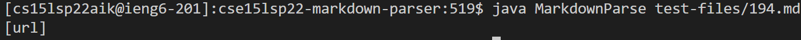
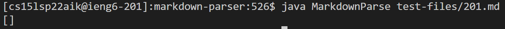
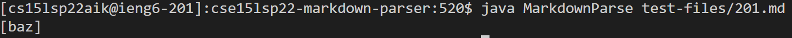

# 5th Lab Report - Comparing the outputs of two different implementations of markdown-parse  

**Note: I am using VSCode preview as a reference for valid links.** 

1. I used vimdiff to display the results of running bash for loop. Here is a picture of the different results:
 

# Link to the test-files 
1. [Test-file 194 MarkdownFile:](https://github.com/nidhidhamnani/markdown-parser/blob/main/test-files/194.md) 
2. [Test-file 194 html-test:](https://github.com/nidhidhamnani/markdown-parser/blob/main/test-files/194.html.test) 
3. [Test-file 201 MarkdownFile:](https://github.com/nidhidhamnani/markdown-parser/blob/main/test-files/201.md) 
4. [Test-file 201 html-test:](https://github.com/nidhidhamnani/markdown-parser/blob/main/test-files/201.html.test)

# First test(test file 194) 
1. Neither of the implementation is correct.
2. A picture of the actual output of my implementation:
 
3. A picture of the actual output of the provided implementation:
 
4. The expected output is: [title (with parens)] 
5. For my implementation, it doesn't take into the account the situation where 
the link itself has a parenthesis inside. It also doesn't check for whether the text in front of the link has a nested bracket. 

# Second test(test file 201) 
1. My implementation is correct while the provided implementation is not correct. 
2. A picture of the actual output of my implementation: 
 
3. A picture of the actual output of the provided implementation:
 
4. The expected output is: [] 
5. For the provided implementation, it doesn't check for whether there is content in between the closed bracket and the open parenthesis, especially there is some non-related content like angle brackets. 